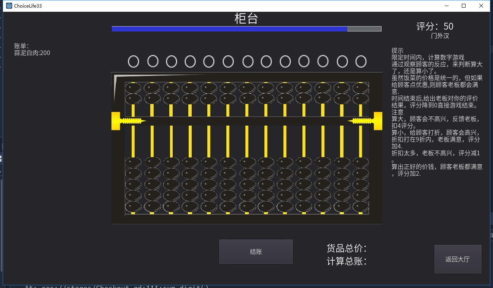

# 武侠与江湖 饭店打工小游戏

## 参加群内 game jam 活动，做的小游戏。

### 说明：
1. 只包含2个小游戏，且完成度还很低。
2. 做菜游戏，就是一个简单的猜配方游戏，根据菜名，猜配方，选择正确加分。
3. 算账游戏，就是一个算数游戏，只是需要在虚拟的算盘上打出正确的数字（也许会点珠算口诀会快一点。~ ~）
4. 计划作为《武侠与江湖》 里面其中的俩个小游戏。
5. 个别截图

* 主场景

* 厨房 做菜

* 柜台 算账

## 其他小游戏计划

为配合房间功能，即将设计测试其他小游戏
* 赛龟 赌哪一只龟现到达终点
* 骰子 赌大小
* 牌九 规则目前还未知
* 抽签 乾 坤 签的数量

* 炼药 火候、材料、器具
* 打猎 场景、弓箭
* 采矿 内力，砍绳子
* 采药 轻功，跳一跳
* 种地 

* 跑商
* 修路
* 断案
* 等等 。。。。。。

工程量浩大。也许在这些之前，我会做个 侠客版 大富翁。= = 

